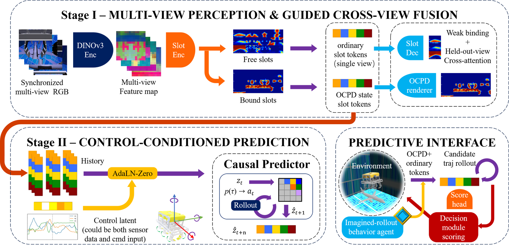
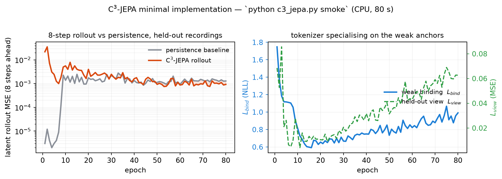
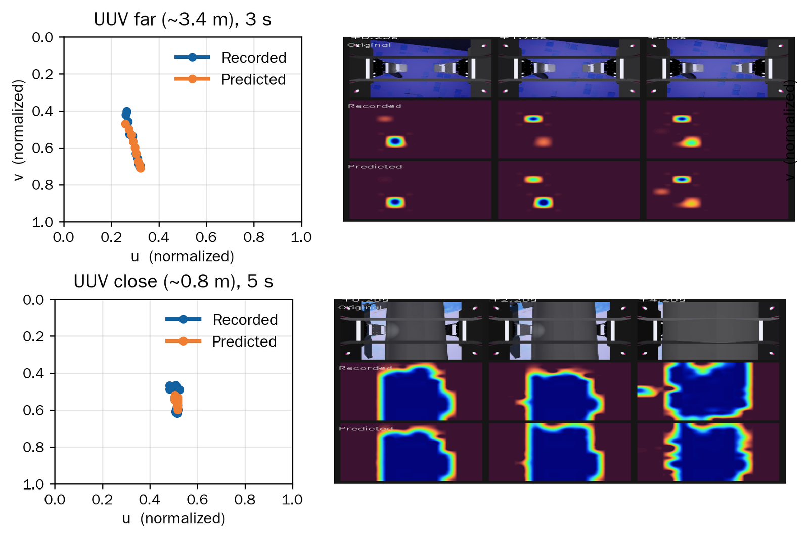
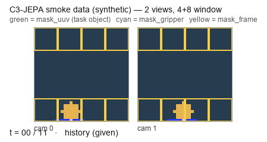

# C³-JEPA — minimal reference implementation

[**Paper**](https://arxiv.org/abs/2609.30214) · [PDF](https://arxiv.org/pdf/2609.30214) · arXiv:2609.30214 (cs.RO) · MIT

Minimal, self-contained implementation of **Underwater C³-JEPA** (cross-view,
control-conditioned, context-extended): an object-centric multi-view predictive
world model for near-field heavy-load underwater ROV salvage.



*Method overview (figure from the paper): stage I grounds synchronized multi-view RGB
into bound object slots plus free context slots; stage II injects the control latent and
predicts the state autoregressively. This repository implements that pipeline.*

One file, one command, no dataset required — the script generates its own synthetic
recordings and runs the full train + test loop on CPU in about a minute:

```bash
pip install -r requirements.txt
python c3_jepa.py smoke
```

```
[smoke] 8 synthetic recordings, 4+8 window, slots=6, device=cpu-first
...            (one JSON line per epoch, 80 epochs)
{
 "best_val_pred_mse": 0.000757,
 "persist_mse": 0.001293,
 "pred_mse": 0.00093,
 "improvement_pct": 28.07
}
[smoke] OK — training and testing both ran end to end.
```

The synthetic run is a wiring test, not a benchmark: it checks that the tokenizer,
the binding term, the held-out-view fusion, SIGReg and the predictor all train, and
that the 8-step rollout beats the persistence baseline on recordings kept out of
training. That is all those numbers mean — the paper's results come from the full
pipeline on real data, not from this file.



*The default `smoke` run, plotted from `runs/smoke/metrics.json`. Left: the 8-step latent
rollout overtakes the persistence baseline once the tokenizer has specialised; the shaded
area is where the model wins. Right: the weak-binding term that drives that specialisation.*

## What is implemented

```
multi-view frames ──► patch tokens ──► per-view slot attention (6 slots)
      │                                        │
      │                                        ▼
      │                          cross-view attention fusion
      │                        (trained with one view held out)
      │                                        │
      │                                        ▼
      └──────── control ──────────► object tokens z_t ──► predictor
                                     (masked history + future object tokens)
```

* **Object-centric tokenizer.** Patch tokens are grouped by competitive slot
  attention into six slots — `0` task object, `1` gripper, `2` fixed ROV frame,
  `3–5` context — followed by a per-slot patch decoder.
* **Weak binding.** Slots `0` / `1` / `2` are anchored to cheap patch-level masks of
  the task object, the gripper and the fixed ROV frame (`-log` of the probability
  mass the slot places inside the target region, applied to both mask branches).
  No dense annotation. Slot `2` is binding-only: no synthesis, and it is excluded
  from the cross-view fusion and from the predictive state.
* **Cross-view fusion with a held-out view.** For every fused slot a learned query
  attends over the per-view instances of that slot and returns one shared token;
  during training one view is hidden and its object tokens must be recovered from
  the fused state.
* **SIGReg.** Sketched isotropic Gaussian regularisation on the per-slot
  representation (after LeWorldModel, Apache-2.0).
* **Control-conditioned, context-extended predictor.** Object-level masking is
  held across the whole history window, `t = 0` is an identity anchor, each future
  step is a mask query + anchor + time embedding, and controls enter as separate
  auxiliary entity tokens — never pooled into visual slots.

### What the full pipeline produces



*From the paper — **not reproduced by this repository**: recorded (blue) and predicted
(orange) mask-centroid tracks of the task object over 3 s rollouts, far and close range.
Those numbers come from the full training/evaluation harness on the 229-recording
interaction set; this file contains the method, not the harness.*


Losses follow Eq. 2 of the paper plus the two auxiliary weights of its Table 1:

```
L       = L_m + λ_b·L_bind + λ_s·L_sigreg + λ_t·L_temporal + λ_v·L_heldout
L_pred  = L_masked_history + L_future
```

Defaults: `λ_m = 1.0`, `λ_b = 1.0`, `λ_s = 0.03`, `λ_t = 0.10`, `λ_v = 0.20`,
slot width `d_s = 256` (adapted to 128 inside the predictor), history `4` steps
(1 s) → future `12` steps (3 s) at 4 Hz, held-out-view attention with `8` heads.

## Commands

| Command | What it does |
|---|---|
| `python c3_jepa.py smoke` | synthetic recordings, CPU, a few seconds; writes `runs/smoke/` |
| `python c3_jepa.py train --data-dir data/recs --out-dir runs/example` | train on real recordings |
| `python c3_jepa.py test --data-dir data/recs --ckpt runs/example/ckpt/best.pt` | evaluate a checkpoint |

The test path reports the rollout error **against the persistence baseline**
(`val_pred_mse`, `persist_mse`, `persist_improvement_pct`) so that a number is
never quoted without the baseline it beats.

## Data

All paths are relative. One `.npz` per recording under `--data-dir`:

| key | shape | meaning |
|---|---|---|
| `frames` | `(V, T, H, W, 3)` uint8 | synchronised camera views, 4 Hz |
| `control` | `(T, C)` float32 | linear/angular velocity + gripper command |
| `mask_uuv` | `(V, T, N)` bool | weak patch-level mask of the task object (optional) |
| `mask_gripper` | `(V, T, N)` bool | weak patch-level mask of the gripper (optional) |
| `mask_frame` | `(V, T, N)` bool | weak patch-level mask of the fixed ROV frame (optional) |
| `timestamps` | `(T,)` float64 | per-step time |

`N = (H // patch) ** 2`. When a weak mask is missing its binding term is skipped
automatically; everything else still trains.



*The synthetic smoke data — two synchronised views with the three weak patch-level masks
the binding term consumes. The counter marks the history (given) and the future (scored)
part of each window. Real recordings feed the same tensors, with patch tokens from a
frozen DINOv3-L backbone instead of the stand-in encoder.*

**Precomputed backbone features (the setting used in the paper).** Pass
`--cached-features DIR` containing `<recording>_<view>_feat.npy` of shape
`(T, N, D)` produced by a frozen DINOv3-L patch encoder. The rest of the pipeline
is unchanged; `--backbone`/`--img` are then ignored. Without this flag the script
uses a small strided convolution as a stand-in patch encoder so that it runs
anywhere.

The recordings, the trained weights and the derived datasets of the paper are not
distributed here.

## Notes and limitations

* This is a **reference implementation**, not the experiment harness: it contains
  the method, not the sweep infrastructure. The numbers in the paper come from the
  full training/evaluation pipeline and are not reproduced by `smoke`.
* The synthetic generator exists only to exercise both code paths end to end.
* Multi-view geometry, the ROV simulator and the field trials are outside this
  file; the interface above is what the paper's experiments feed into it.

## Citation

Paper: <https://arxiv.org/abs/2609.30214>

```bibtex
@misc{yang2026underwaterc3jepa,
  title         = {Underwater C$^3$-JEPA: An Object-Centric Cross-View World Model for ROV Salvage},
  author        = {Yang, Yuncong and Li, Jinlong and Xue, Yulong and Wu, Feng and Zhang, Chunwen and Qiao, Lei and Wang, Xuyang},
  year          = {2026},
  eprint        = {2609.30214},
  archivePrefix = {arXiv},
  primaryClass  = {cs.RO}
}
```

## Acknowledgements

The SIGReg implementation follows the LeWorldModel reference implementation
(Apache-2.0).
