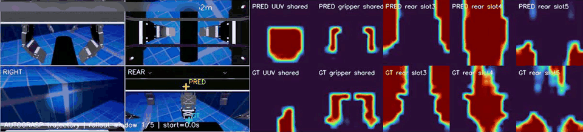

# C³-JEPA

[**Paper**](https://arxiv.org/abs/2609.30214) · [PDF](https://arxiv.org/pdf/2609.30214) · arXiv:2609.30214 (cs.RO) · MIT

A world model for ROV salvage. It takes several camera views and the operator's
controls, and predicts where the object, the gripper and the surrounding scene move
next. This repository is the reference implementation from the paper — one file,
runnable on a laptop CPU.


*Method overview (from the paper): stage I grounds the multi-view frames into bound
object slots plus context slots, stage II predicts them autoregressively under the
control latent.*

Everything lives in `c3_jepa.py`. The smoke run generates its own synthetic recordings
and trains and tests end to end — on a GPU when there is one, otherwise on CPU:

```bash
pip install -r requirements.txt
python c3_jepa.py smoke
```

```
[smoke] 8 synthetic recordings, 4+8 window, slots=6, device=cpu
...            (one JSON line per epoch, 80 epochs)
{
 "best_val_pred_mse": 0.000757,
 "persist_mse": 0.001293,
 "pred_mse": 0.00093,
 "improvement_pct": 28.07
}
[smoke] OK — training and testing both ran end to end.
```

On a GPU the same command prints `device=cuda (<device name>)`; on an A800 it takes 36 s
instead of 86 s. The numbers move slightly between devices — same loss surface, another
point on it — so read the block above as one run, not a fixed result.

The smoke run is a wiring test, not a benchmark: everything trains, and the 8-step
rollout beats persistence on the two recordings held out of training. The paper's
numbers come from the full pipeline on real data.


*From `runs/smoke/metrics.json`: rollout vs persistence (left), binding loss (right).*

## What is implemented

```
multi-view frames ──► patch tokens ──► per-view slot attention (6 slots)
      │                                        │
      │                                        ▼
      │                          cross-view attention fusion
      │                        (trained with one view held out)
      │                                        │
      │                                        ▼
      └──────── control ──────────► object tokens z_t ──► predictor
                                     (masked history + future object tokens)
```

* **Object-centric tokenizer.** Patch tokens are grouped by competitive slot
  attention into six slots — `0` task object, `1` gripper, `2` fixed ROV frame,
  `3–5` context — followed by a per-slot patch decoder.
* **Weak binding.** Slots `0` / `1` / `2` are anchored to cheap patch-level masks of
  the task object, the gripper and the fixed ROV frame (`-log` of the probability
  mass the slot places inside the target region, applied to both mask branches).
  No dense annotation. Slot `2` is binding-only: no synthesis, and it is excluded
  from the cross-view fusion and from the predictive state.
* **Cross-view fusion with a held-out view.** For every fused slot a learned query
  attends over the per-view instances of that slot and returns one shared token;
  during training one view is hidden and its object tokens must be recovered from
  the fused state.
* **SIGReg.** Sketched isotropic Gaussian regularisation on the per-slot
  representation (after LeWorldModel, Apache-2.0).
* **Control-conditioned, context-extended predictor.** Object-level masking is
  held across the whole history window, `t = 0` is an identity anchor, each future
  step is a mask query + anchor + time embedding, and controls enter as separate
  auxiliary entity tokens — never pooled into visual slots.

Losses follow Eq. 2 of the paper plus the two auxiliary weights of its Table 1:

```
L       = L_m + λ_b·L_bind + λ_s·L_sigreg + λ_t·L_temporal + λ_v·L_heldout
L_pred  = L_masked_history + L_future
```

Defaults: `λ_m = 1.0`, `λ_b = 1.0`, `λ_s = 0.03`, `λ_t = 0.10`, `λ_v = 0.20`,
slot width `d_s = 256` (adapted to 128 inside the predictor), history `4` steps
(1 s) → future `12` steps (3 s) at 4 Hz, held-out-view attention with `8` heads.

**A rollout on a real recording** (from the paper's pipeline):



*Camera views at left, decoded object masks at right — predicted row above the recorded
one, with the controls taken from the recording.*

## Commands

| Command | What it does |
|---|---|
| `python c3_jepa.py smoke` | synthetic recordings, GPU when one is present; writes `runs/smoke/` |
| `python c3_jepa.py train --data-dir data/recs --out-dir runs/example` | train on real recordings |
| `python c3_jepa.py test --data-dir data/recs --ckpt runs/example/ckpt/best.pt` | evaluate a checkpoint |

The test path reports the rollout error next to the persistence baseline
(`val_pred_mse`, `persist_mse`, `persist_improvement_pct`).

## Data

All paths are relative. One `.npz` per recording under `--data-dir`:

| key | shape | meaning |
|---|---|---|
| `frames` | `(V, T, H, W, 3)` uint8 | synchronised camera views, 4 Hz |
| `control` | `(T, C)` float32 | linear/angular velocity + gripper command |
| `mask_uuv` | `(V, T, N)` bool | weak patch-level mask of the task object (optional) |
| `mask_gripper` | `(V, T, N)` bool | weak patch-level mask of the gripper (optional) |
| `mask_frame` | `(V, T, N)` bool | weak patch-level mask of the fixed ROV frame (optional) |
| `timestamps` | `(T,)` float64 | per-step time |

`N = (H // patch) ** 2`. When a weak mask is missing its binding term is skipped
automatically; everything else still trains.


*Synthetic smoke data: two views with the three weak masks the binding term uses. Real
recordings feed the same tensors, with patch tokens from a frozen backbone instead of the
stand-in encoder.*

**Precomputed backbone features (the setting used in the paper).** Pass
`--cached-features DIR` containing `<recording>_<view>_feat.npy` of shape
`(T, N, D)` produced by a frozen DINOv3-L patch encoder. The rest of the pipeline
is unchanged; `--backbone`/`--img` are then ignored. Without this flag the script
uses a small strided convolution as a stand-in patch encoder so that it runs
anywhere.

The recordings, the trained weights and the derived datasets of the paper are not
distributed here.

## Scope

Multi-view geometry, the ROV simulator and the field trials live in separate projects.

## Citation

Paper: <https://arxiv.org/abs/2609.30214>

```bibtex
@misc{yang2026underwaterc3jepa,
  title         = {Underwater C$^3$-JEPA: An Object-Centric Cross-View World Model for ROV Salvage},
  author        = {Yang, Yuncong and Li, Jinlong and Xue, Yulong and Wu, Feng and Zhang, Chunwen and Qiao, Lei and Wang, Xuyang},
  year          = {2026},
  eprint        = {2609.30214},
  archivePrefix = {arXiv},
  primaryClass  = {cs.RO}
}
```

## Acknowledgements

The SIGReg implementation follows the LeWorldModel reference implementation
(Apache-2.0).
